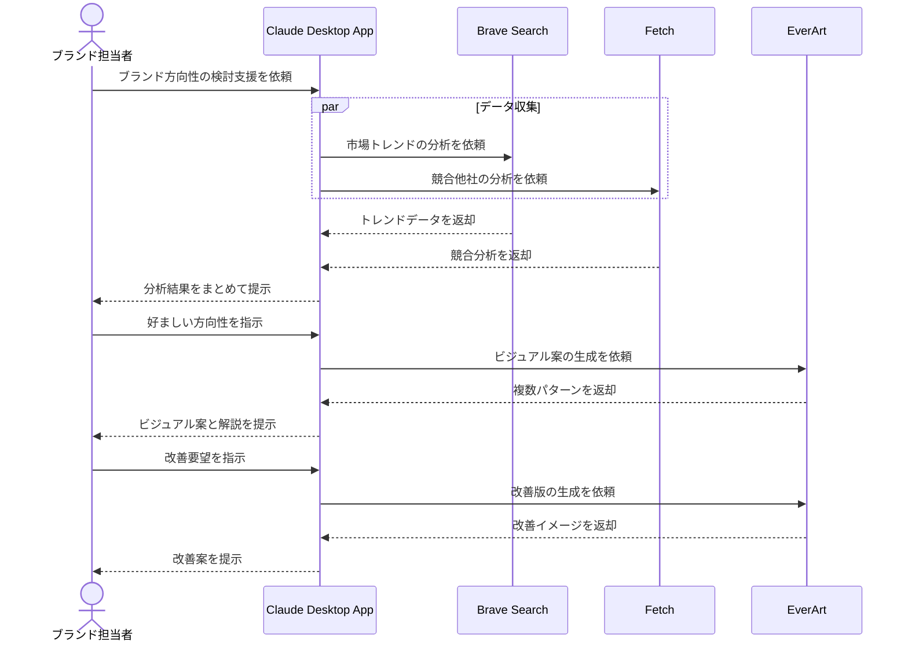

# ブランドイメージの構築を視覚化する

## アイデア
ブランドの方向性検討において、市場分析とAI生成アートを組み合わせて複数の視覚的イメージを作成し、有効な議論のきっかけとする 

### 具体例
化粧品ブランドのリニューアルにおいて、市場トレンドとターゲット層の嗜好性をAIで分析し、それに基づいた複数のビジュアルイメージを生成。それを基に、ブランドチームが具体的な方向性を検討する 

## アーキテクチャ
| Type | Name | Role |
|--|--|--|
| Client | Claude Desktop App | ブランド分析と視覚化の支援 |
| Server | Brave Search | 市場トレンドとターゲット層の分析 |
| Server | Fetch | 競合他社の動向分析 |
| Server | EverArt | ブランドイメージの視覚化生成 |

## 思考プロセス

### 対象の活動の価値は何か
- 市場データに基づく、ブランド方向性の客観的な検討
- 視覚的なイメージによる、具体的な議論の促進
- 複数パターンの比較検討による、創造的な発想の支援

### 価値を妨げる課題は何か
- データ分析とクリエイティブ発想の両立
- ブランドイメージの定性的な要素の表現
- 検討過程での関係者間の認識共有

### なぜ課題が発生するのか、仮説推論
- データ分析とデザイン要素の橋渡しの難しさ
- ブランドの持つ感情的・文化的な要素の複雑さ
- 関係者それぞれの持つブランドイメージの違い