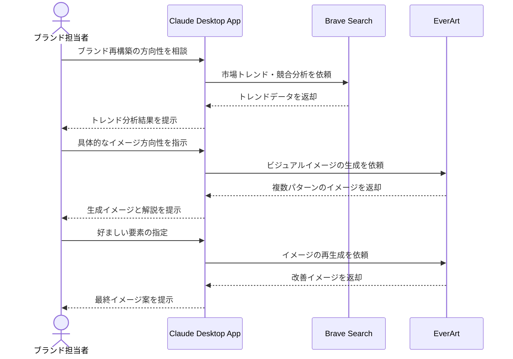

# ブランドイメージの構築を視覚化する

## アイデア
ブランドの方向性検討において、市場分析データとAI生成アートを組み合わせて視覚的なイメージを作成し、関係者との認識共有と創造的な議論を促進する 

### 具体例
化粧品ブランドのリニューアルにおいて、市場トレンドやターゲット層の嗜好性をAIで分析し、それに基づいた複数のビジュアルイメージを生成。それを基に、商品開発チームやデザイナーが具体的なブランドの方向性を検討する 

## アーキテクチャ
| Type | Name | Role |
|--|--|--|
| Client | Claude Desktop App | ブランド分析と視覚化の統合支援 |
| Server | Brave Search | 市場トレンドとターゲット層の分析 |
| Server | EverArt | ブランドイメージの視覚化生成 |

