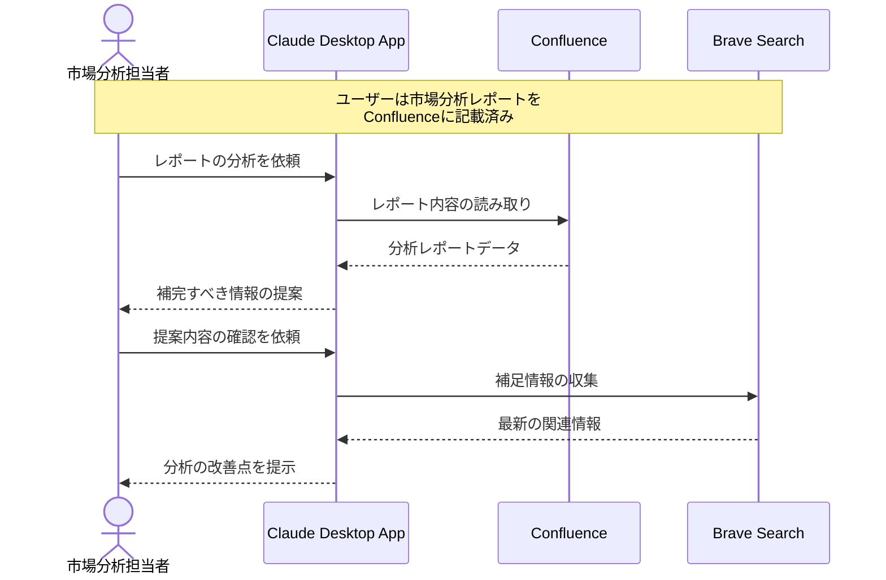

# 市場分析レポートの質を高める

## アイデア
既存の市場分析レポートをConfluenceから読み取り、BraveSearchを活用して必要な補足情報を収集。データの質を高めながら、対話的に市場分析の精度を向上させます。 

### 具体例
自動車メーカーの市場分析担当者が、電気自動車市場の分析レポートをConfluenceにまとめた後、その内容を基に自動で補完すべき情報を特定。重要な変化や見落としを防ぎながら、分析の質を向上させます。 

## アーキテクチャ
| Type | Name | Role |
|--|--|--|
| Client | Claude Desktop App | 分析の対話型アシスタント |
| Server | Confluence | 分析レポートの読み取り |
| Server | Brave Search | 補足情報の収集 |

## 思考プロセス

### 対象の活動の価値は何か
- 分析レポートの網羅性・妥当性の向上 
- データの欠落や偏りの早期発見 
- 市場変化の見落とし防止 

### 価値を妨げる課題は何か
- 分析レポートの見落としや盲点の存在 
- 最新のデータや動向との整合性確認 
- 分析の質が担当者の経験に依存 

### なぜ課題が発生するのか、仮説推論
- 分析対象の市場や技術が複雑化 
- データソース間の更新タイミングのズレ 
- 分析の視点や観点の固定化 