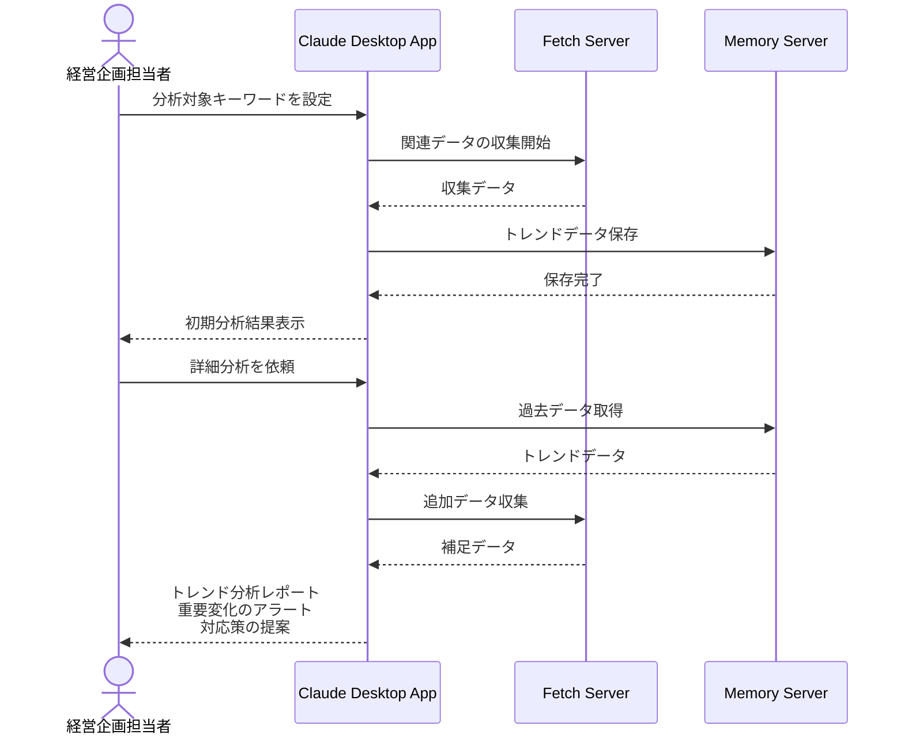

# 市場動向の分析を自動化する

## アイデア
市場動向の分析作業を効率化するため、複数のニュースソースやソーシャルメディアのデータを自動収集し、トレンド分析と可視化を行います。市場の変化を早期に察知し、タイムリーな経営判断を支援します。 

### 具体例
消費財メーカーの経営企画担当者が、商品カテゴリーの市場トレンドを分析する際、ニュース記事やSNSの投稿を自動収集・分類。キーワードの出現頻度や感情分析から、消費者ニーズの変化や競合動向を可視化します。重要な変化には自動でアラートが上がり、早期の対応が可能になります。 

## アーキテクチャ
| Type | Name | Role |
|--|--|--|
| Client | Claude Desktop App | データ分析、レポート生成のインターフェース |
| Server | Fetch | ニュース記事やSNSデータの収集 |
| Server | Memory | トレンドデータの保存・分析 |

