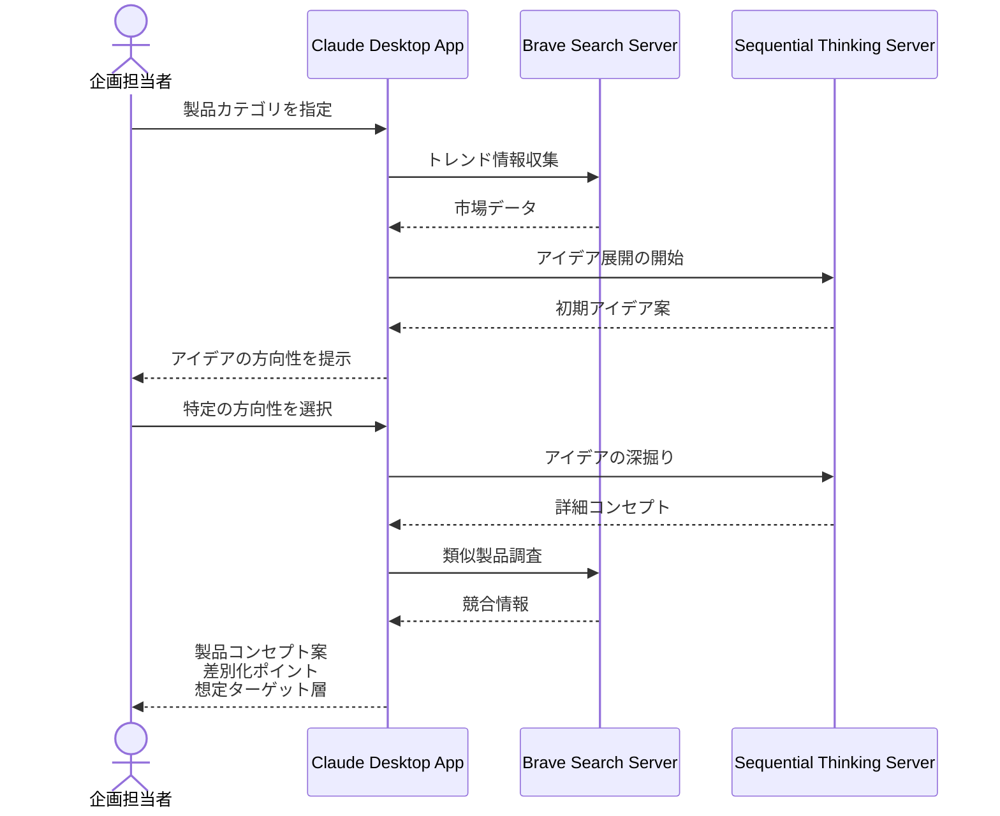

# 新商品のアイデア発想を促進する

## アイデア
市場のトレンド情報と既存商品の分析データを組み合わせ、新商品のアイデア発想を支援します。消費者の声やライフスタイルの変化を自動で分析し、製品企画者の創造的思考を刺激する仕組みを提供します。 

### 具体例
日用品メーカーの企画担当者が新製品を構想する際、SNSでの消費者の声や市場トレンドを分析。既存商品の特徴と組み合わせて、新しい製品コンセプトのアイデアを生成します。環境配慮や使いやすさなど、多角的な視点からの提案を受けることで、より革新的な製品企画が可能になります。 

## アーキテクチャ
| Type | Name | Role |
|--|--|--|
| Client | Claude Desktop App | アイデア生成、分析のインターフェース |
| Server | Brave Search | 市場トレンド、消費者の声の収集 |
| Server | Sequential Thinking | アイデアの段階的な発展支援 |

