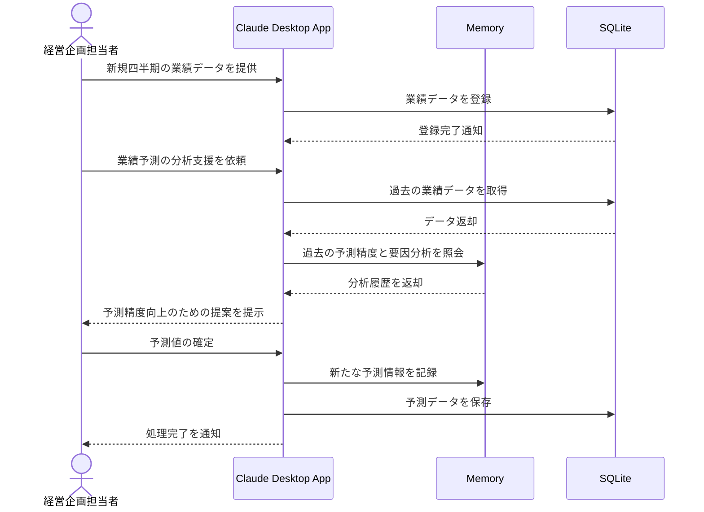

# 業績予測の分析精度を向上する

## アイデア
過去の業績予測の精度や、その時の外部要因との相関関係を記憶し、新たな業績予測作成時に活用することで、より精度の高い予測を実現する 

### 具体例
製造業の経営企画部門で、事業部別の業績予測を四半期ごとに作成する際に、過去の予測と実績の差異、およびその要因分析を活用して、より正確な予測を立案する 

## アーキテクチャ
| Type | Name | Role |
|--|--|--|
| Client | Claude Desktop App | 予測精度向上のための分析と提案 |
| Server | Memory | 過去の予測と実績、および要因分析の記憶 |
| Server | SQLite | 業績データの保存と分析 |

