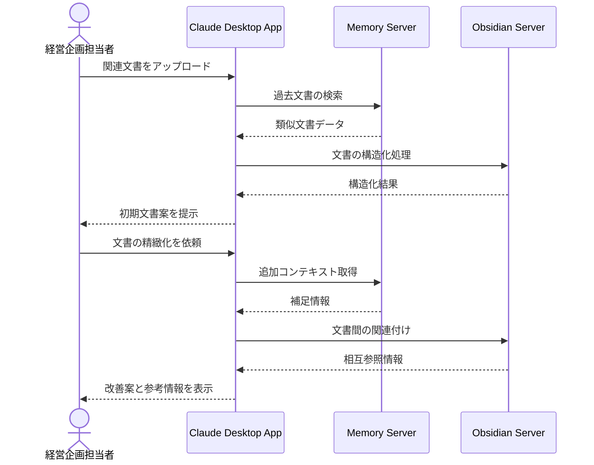

# 経営戦略の文書化を支援する

## アイデア
経営戦略の文書化プロセスを効率化するため、過去の文書や議事録から重要な意思決定や方針を自動で抽出・整理し、戦略文書の作成を支援します。一貫性のある表現と構造化された文書作成により、組織内での共有と理解を促進します。 

### 具体例
中期経営計画の策定時に、経営会議の議事録や部門からの報告書を分析し、重要な戦略要素を抽出。業界標準の文書構成に沿って整理し、一貫性のある表現で文書化を支援します。過去の類似文書との比較により、表現の統一性や必要な要素の過不足をチェックできます。 

## アーキテクチャ
| Type | Name | Role |
|--|--|--|
| Client | Claude Desktop App | 文書分析、構造化のインターフェース |
| Server | Memory | 戦略文書や議事録の保存・検索 |
| Server | Obsidian Markdown Notes | 文書の構造化と相互参照管理 |

