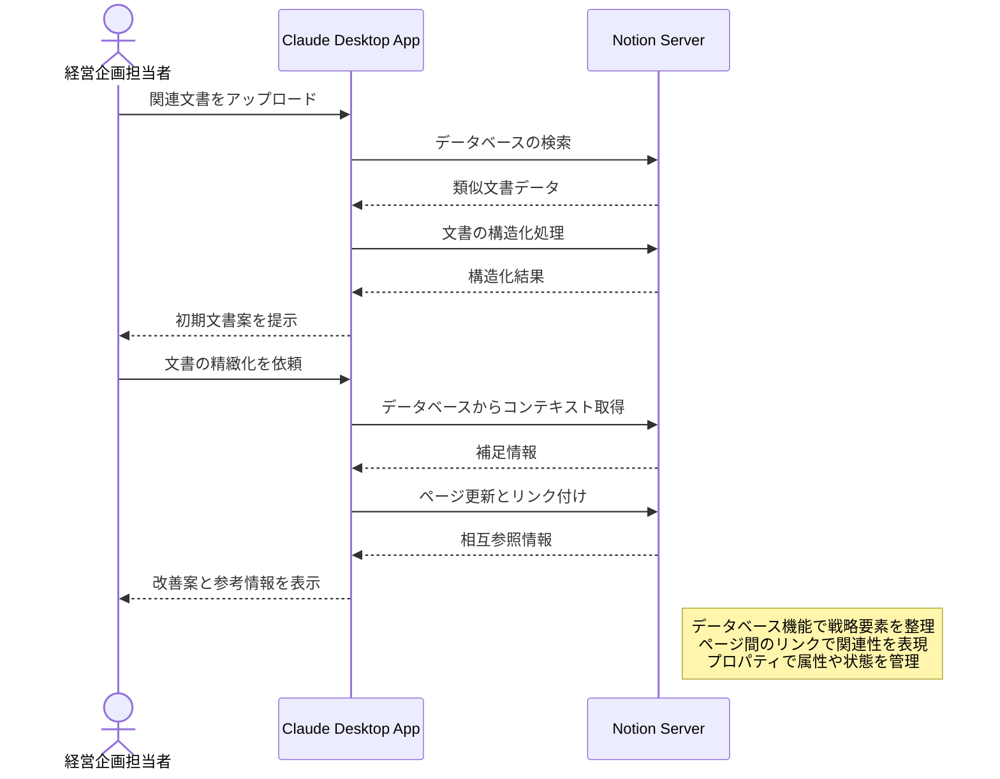

# 経営戦略の文書化を支援する

## アイデア
経営戦略の文書化プロセスを効率化するため、過去の文書や議事録から重要な意思決定や方針を自動で抽出・整理し、戦略文書の作成を支援します。一貫性のある表現と構造化された文書作成により、組織内での共有と理解を促進します。

### 具体例
中期経営計画の策定時に、経営会議の議事録や部門からの報告書を分析し、重要な戦略要素を抽出。業界標準の文書構成に沿って整理し、一貫性のある表現で文書化を支援します。過去の類似文書との比較により、表現の統一性や必要な要素の過不足をチェックできます。

## アーキテクチャ
| Type | Name | Role |
|--|--|--|
| Client | Claude Desktop App | 文書分析、構造化のインターフェース |
| Server | Notion | 文書の構造化管理とデータベース化 |

## 思考プロセス

### 対象の活動の価値は何か
- 機能チーム間での相対的なコスト効率の可視化
- リソース利用パターンの比較による具体的な改善点の特定
- チーム固有の制約を考慮した実現可能な最適化提案
- 最適化パターンの組織的な共有と活用

### 価値を妨げる課題は何か
- コストデータと機能チームの紐付けの複雑さ
- チーム間の技術スタックやワークロードの違い
- 最適化とサービス品質のバランス
- チーム固有の要件や制約の考慮

### なぜ課題が発生するのか、仮説推論
- タグ付けルールの統一が困難
- 機能要件によるインフラ構成の違い
- チーム間でのベストプラクティス共有の不足
- コスト最適化の優先度がチームにより異なる