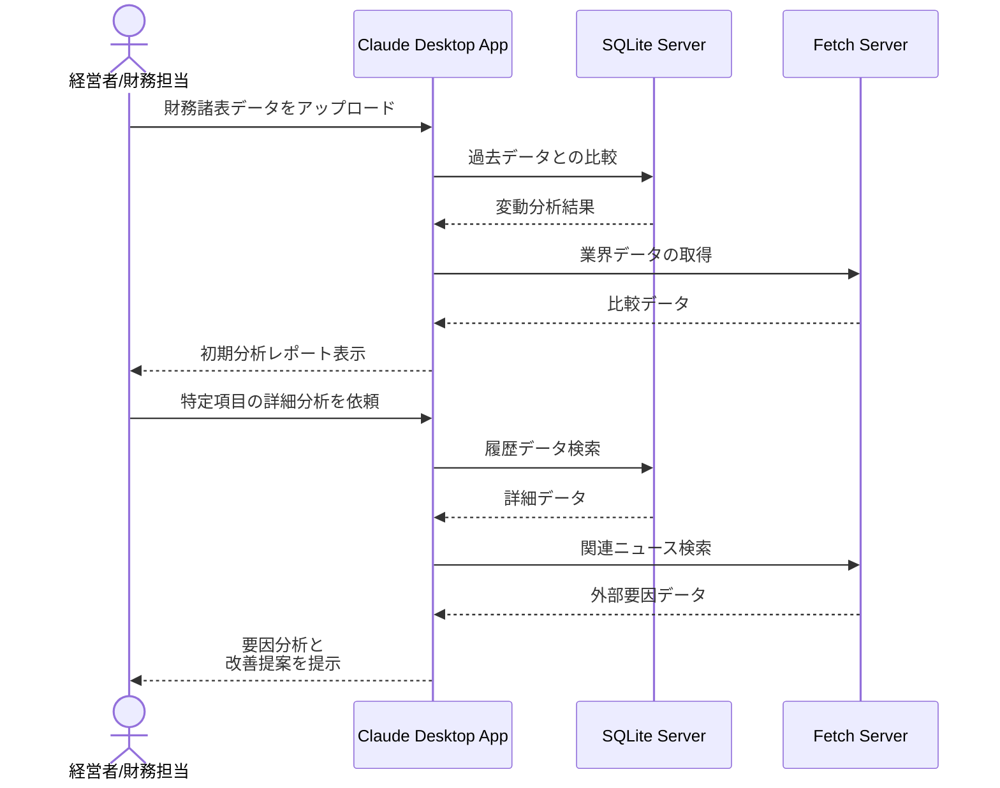

# 財務諸表の精査作業を効率化する

## アイデア
財務諸表の精査作業を効率化するため、過去のデータとの整合性チェックや業界標準との比較を自動化します。異常値の検出と原因分析を支援し、経営判断に必要な洞察を迅速に提供します。 

### 具体例
四半期ごとの財務諸表を分析する際、過去の実績データと自動で比較し、大きな変動がある項目を抽出。同業他社の公開データとも照合し、業界トレンドとの乖離を検出します。AIが異常値の考えられる要因を提示し、調査の優先順位付けを支援します。 

## アーキテクチャ
| Type | Name | Role |
|--|--|--|
| Client | Claude Desktop App | 財務データ分析、レポート生成のインターフェース |
| Server | SQLite | 財務データと過去実績の保存・検索 |
| Server | Fetch | 業界データの取得・更新 |

