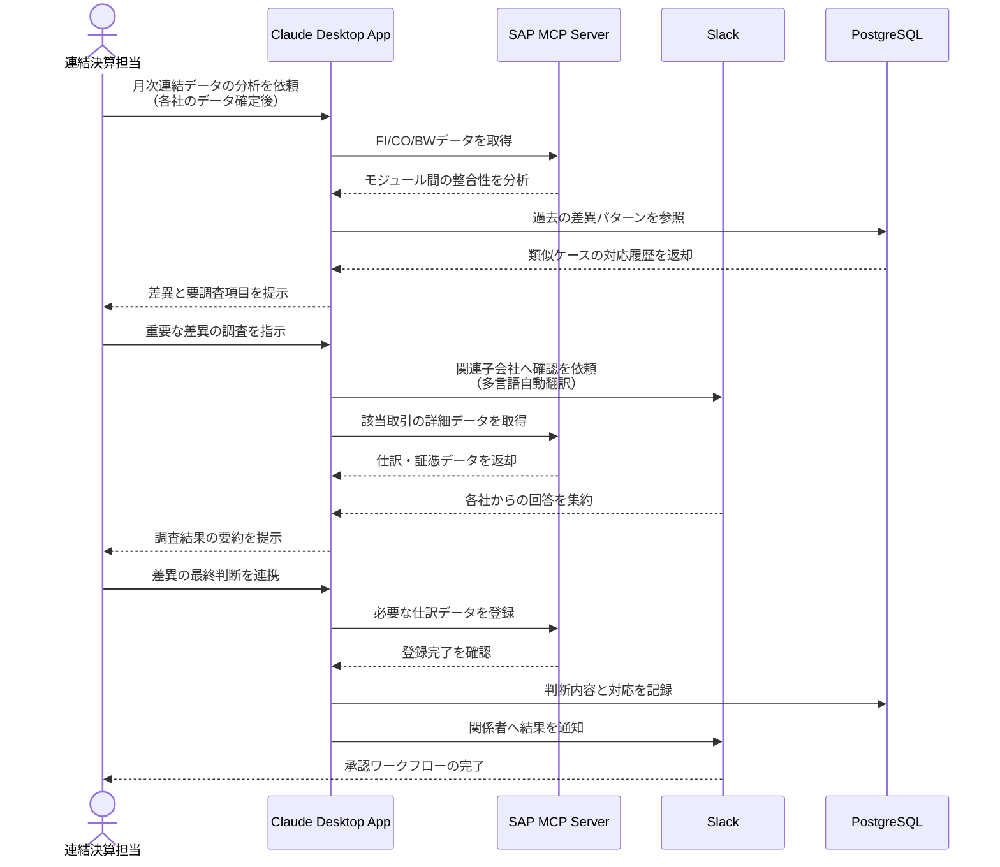

# 連結決算の整合性を効率化する

## アイデア
SAP S/4HANAを利用した連結決算業務において、子会社間の財務データの整合性確認と異常値の調査プロセスを自動化。Slackでのグローバルなコミュニケーションを統合し、時差を超えた迅速な調整を実現する。 

### 具体例
製造業の財務部門で、20社の子会社を含む月次連結決算を行う場面。財務会計、管理会計、データ分析の各モジュールのデータを照合し、各社の経理担当者との調整を経て、最終的な決算数値を確定させる。 

## アーキテクチャ
| Type | Name | Role |
|--|--|--|
| Client | Claude Desktop App | 分析支援と多言語コミュニケーション |
| Server | SAP MCP Server [要自作] | SAP S/4HANAとの双方向連携 |
| Server | Slack | グローバルな調整と承認フロー |
| Server | PostgreSQL | 差異分析結果と対応履歴の管理 |

## 思考プロセス

### 対象の活動の価値は何か
- データの正確性と信頼性の確保 
    - 財務報告の信頼性は企業の生命線 
    - 経営判断やステークホルダーへの説明責任のため 
- 迅速な問題把握と対応 
    - 早期の是正措置が可能になる 
    - 財務上の問題は時間経過で深刻化するため 
- グループ全体の財務状況の可視化 
    - 戦略的な意思決定の基盤となる 
    - グローバル競争下での迅速な判断が必要なため 

### 価値を妨げる課題は何か
- SAPモジュール間の連携の複雑さ 
- 子会社間のデータ形式の違い 
- コミュニケーションの非効率性 

### なぜ課題が発生するのか、仮説推論
- 各モジュールが独立して発展してきた歴史的背景 
- 各国の会計基準や慣習の違いによるシステムの多様性 
- 時差や言語の壁、組織の階層構造による調整コストの存在 