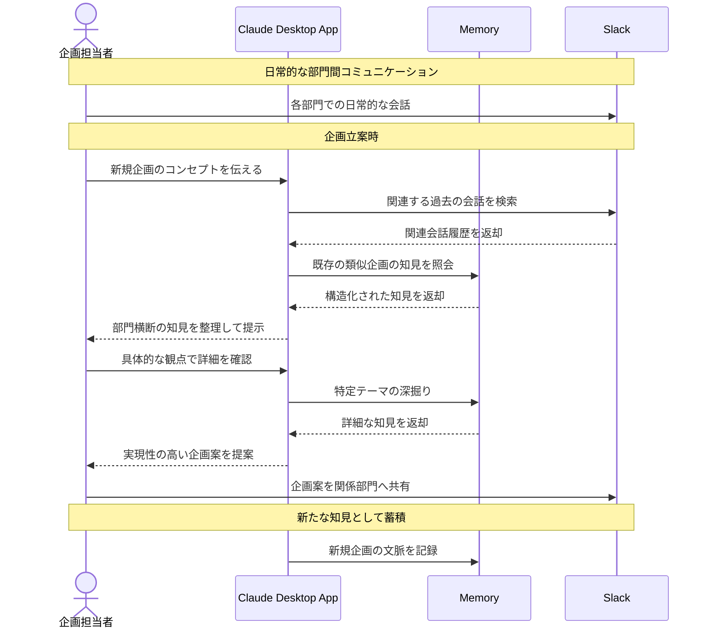

# 部門横断の暗黙知を企画立案に活用する

## アイデア
各部門のSlackコミュニケーションから暗黙知やナレッジを自動的に蓄積し、新規企画立案時に関連する過去の知見や経験を活用できるようにする 

### 具体例
新規サービスの企画立案時に、営業部門の顧客フィードバック、開発部門の技術的知見、運用部門の実務経験など、これまでSlackに散在していた関連する暗黙知を自動的に整理・提供することで、より実現性の高い企画を立案する 

## アーキテクチャ
| Type | Name | Role |
|--|--|--|
| Client | Claude Desktop App | 暗黙知の分析と企画立案支援 |
| Server | Memory | 部門横断の知見やナレッジの構造化保存 |
| Server | Slack | 部門間コミュニケーションの取得 |

