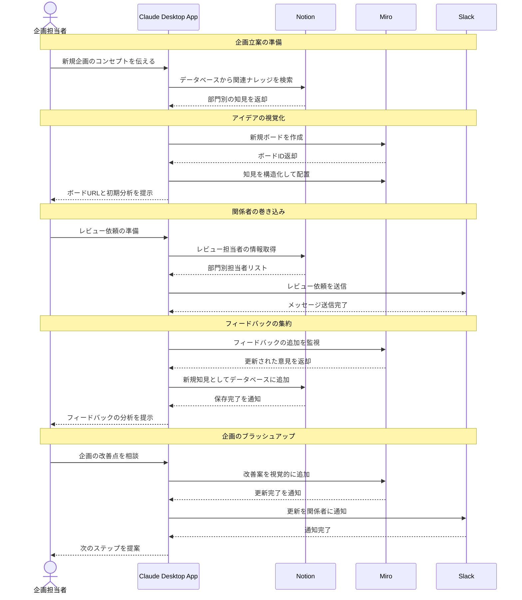

# 部門横断の暗黙知を企画立案に活用する

## アイデア
Notionに集約された部門横断のナレッジと、Miroを活用したビジュアルなアイデア展開を組み合わせることで、より実効性の高い企画立案を実現する。関係者の知見をインタラクティブに取り込みながら企画をブラッシュアップする。

### 具体例
新規サービスの企画立案時に、Notionの部門別ナレッジベースから関連する知見を抽出し、Miroボード上で視覚的に整理。営業・開発・運用など各部門の関係者がMiro上で直接フィードバックを提供することで、実現性の高い企画を協働で作り上げる。

## アーキテクチャ
| Type | Name | Role |
|--|--|--|
| Client | Claude Desktop App | 企画立案の対話型アシスタント |
| Server | Notion | 部門横断ナレッジの統合管理 |
| Server | Miro | 企画立案の視覚化と協働 |
| Server | Slack | 関係者への共有と通知 |

## 思考プロセス

### 対象の活動の価値は何か
- 部門横断知見の効率的な活用
- 視覚的な情報整理による理解促進
- インタラクティブなフィードバック収集
- 協働での企画ブラッシュアップ

### 価値を妨げる課題は何か
- 部門ごとに異なる文脈の理解
- 暗黙知の形式知化と構造的な整理
- 関係者の積極的な参加促進
- フィードバックの適切な反映

### なぜ課題が発生するのか、仮説推論
- 部門特有の専門用語や考え方
- 知見共有のインセンティブ不足
- リアルタイムコラボレーションの難しさ
- 改善提案の優先順位付けの複雑さ