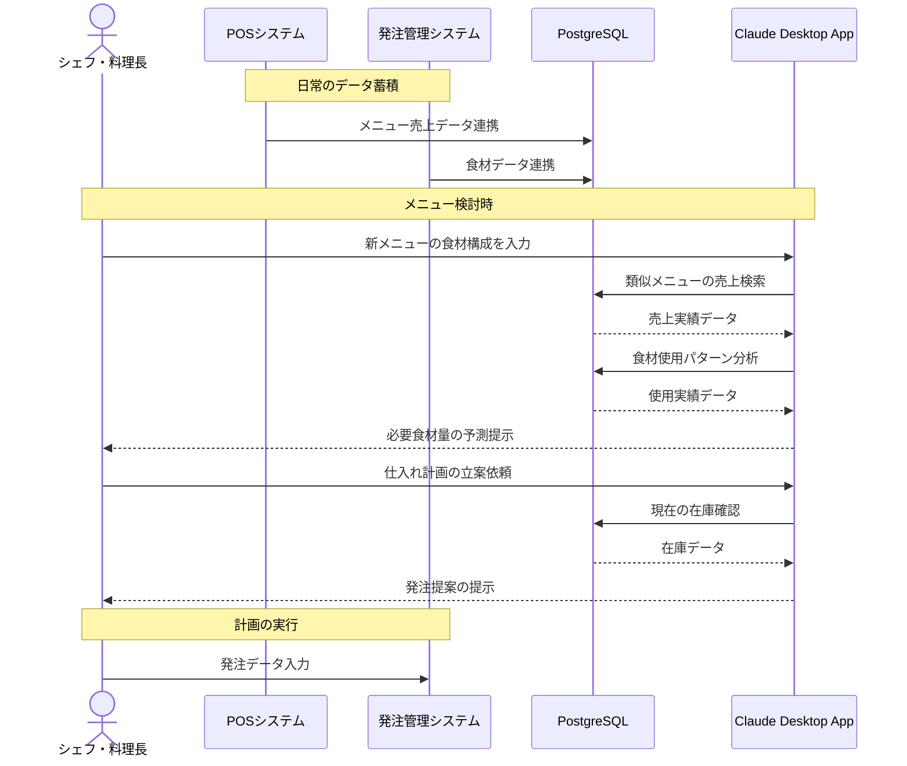

# メニューと連動した仕入れを実現する

## アイデア
POSシステムのメニュー売上データと発注管理システムの食材データを組み合わせ、より柔軟な仕入れ計画を実現します。特に、新メニュー導入時や季節メニュー切り替え時に、過去の類似メニューの売上実績から必要食材を予測。食材の組み合わせパターンを学習し、メニュー改定と仕入れの連動を支援します。

### 具体例
店舗のシェフが新メニューを考案した際、似た食材構成の既存メニューの売上傾向から、必要な食材量を予測。同時に、既存メニューとの食材の共通利用も分析し、新メニュー導入に伴う仕入れ計画の最適化を提案します。また、特定の食材の仕入れ制約がある場合、その食材を使用するメニューの提供数調整も提案可能です。

## アーキテクチャ

| Type | Name | Role |
|--|--|--|
| Client | Claude Desktop App | メニューと食材の分析、提案生成 |
| Server | PostgreSQL | POSと発注システムのデータ統合・分析 |

## 思考プロセス

### 対象の活動の価値は何か
- メニューと食材使用の相関に基づく適切な仕入れ 
- 新メニュー導入時のリスク軽減 
- 食材の効率的な活用による原価管理 
- メニュー改定の柔軟性向上

### 価値を妨げる課題は何か
1. メニュー売上と食材消費の関係性把握が不十分 
2. 新メニュー導入時の食材予測が困難 
3. 食材制約とメニュー構成の最適化が複雑

### なぜ課題が発生するのか、仮説推論
1. メニュー売上と食材消費の関係性把握が不十分
    - POSデータと発注データが別々に管理されている 
    - メニュー間での食材共有の影響が見えにくい 
    - 時期による売上変動の影響が予測しづらい

2. 新メニュー導入時の食材予測が困難
    - 類似メニューの実績が活用されていない 
    - 食材の組み合わせパターンが分析されていない 
    - 複数メニューでの食材共有効果が計算できない

3. 食材制約とメニュー構成の最適化が複雑
    - 食材の仕入れ制約がメニューに反映されにくい 
    - メニュー間の食材依存関係が把握しづらい 
    - 提供数の調整が経験則に依存している