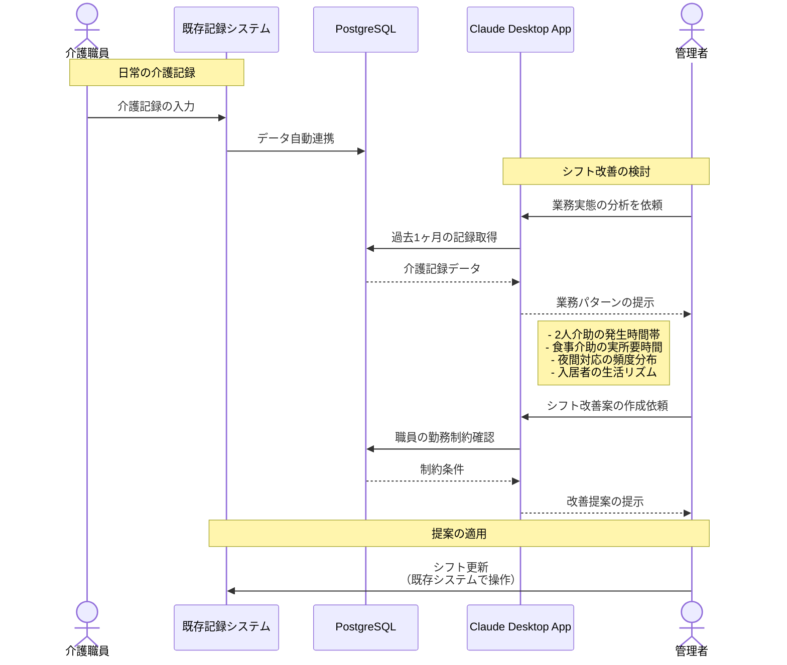

# 介護業務実績からシフトを改善する

## アイデア
既存の介護記録システムに蓄積されたデータをPostgreSQLで分析し、業務実態に基づくシフト最適化を実現します。日々の介護記録から業務の特徴（必要人数、タイミング、所要時間など）を抽出・分析し、これを元に次期シフトのアドバイスを提供します。既存システムを活かしながら、より実践的なシフト改善を支援します。

### 具体例
あるフロアで、2人介助の必要な入居者が集中する時間帯に人手が不足していることが、介護記録の分析から判明。食事介助と重なる時間帯での2人介助予定を考慮し、シフトのピーク時間を微調整することで、より安全な介護体制を実現できます。また、夜間の急変対応記録から、バックアップ体制が必要な時間帯も特定できます。

## アーキテクチャ

| Type | Name | Role |
|--|--|--|
| Client | Claude Desktop App | 介護記録の分析とシフトアドバイスの提供 |
| Server | PostgreSQL | 介護記録の保存・分析（既存システムと連携） |

## 思考プロセス

### 対象の活動の価値は何か
- 実際の介護記録に基づく、より実態に即したシフト作成 
- 入居者の安全性と快適性の向上 
- 職員の働きやすさと業務効率の改善 
- 介護の質の向上と職員の負担軽減の両立

### 価値を妨げる課題は何か
1. 記録内容とシフト計画の連携不足 
2. 業務実態の定量的な把握が困難 
3. 介護記録からの知見抽出が不十分

### なぜ課題が発生するのか、仮説推論
1. 記録内容とシフト計画の連携不足
    - 記録はされているが、シフト計画への活用が不十分 
    - 記録内容からシフトへの示唆を得る仕組みがない 
    - 介護記録の詳細な分析が人手では困難

2. 業務実態の定量的な把握が困難
    - 2人介助の実施タイミングが記録されていても分析されていない 
    - 時間帯ごとの業務量の変動が可視化されていない 
    - 職員の実際の業務負荷が数値化されていない

3. 介護記録からの知見抽出が不十分
    - 日々の記録が蓄積されるだけで、パターン分析がされていない 
    - 入居者の生活リズムと職員配置の整合性が検証されていない 
    - 過去の記録から得られる教訓が活用されていない