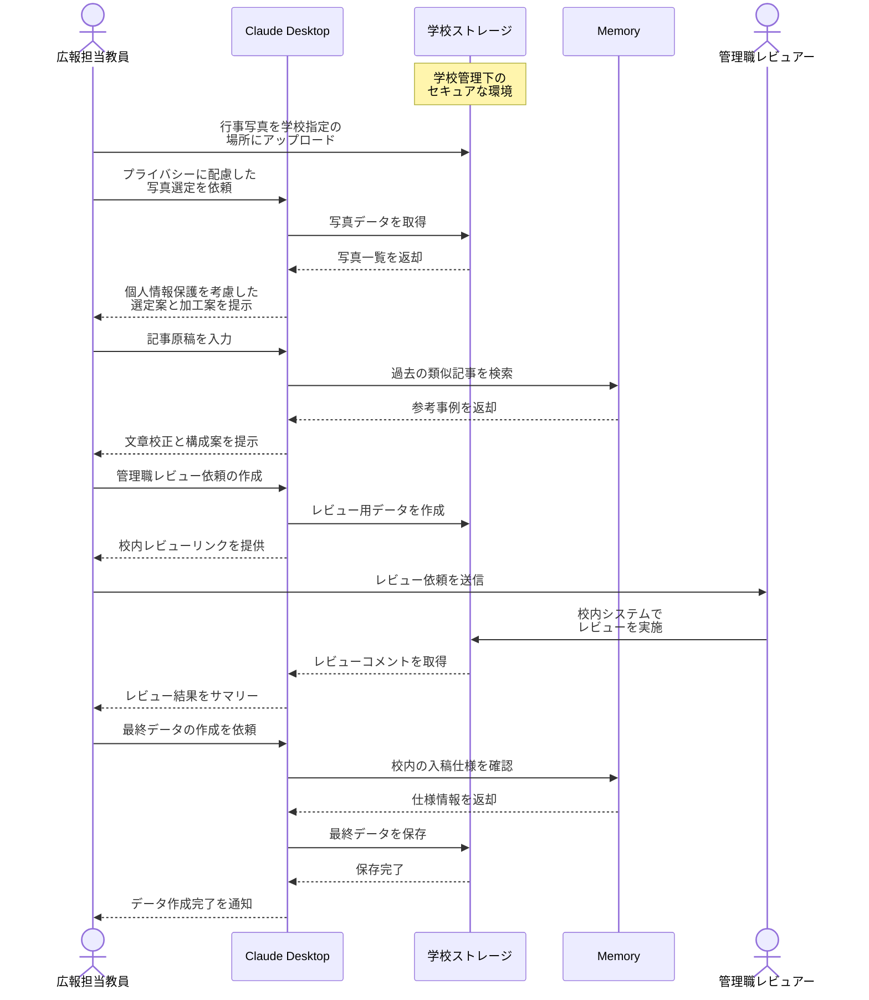

# 学校広報誌の編集作業を支援する

## アイデア
学校管理のセキュアなストレージとMemory Serverを組み合わせて、学校広報誌の編集業務全体を効率化。写真や個人情報は学校のネットワーク内で厳重に管理しながら、教職員の広報業務をトータルに支援する。

> **Note:** このアイデアの実現には、学校指定のセキュアなストレージ（例：学校ドメインのGoogle Workspace for Education、オンプレミスストレージなど）の利用が前提となります。写真や個人情報を含むデータは、常に学校の管理下で扱います。

### 具体例
運動会の広報記事作成において、広報担当教員が学校の指定ストレージに写真をアップロード。Claudeが個人情報に最大限配慮しながら、適切な写真の選定と加工案（必要に応じてモザイク処理など）を提案。文章校正や構成案の提示、関係者によるレビューまで、すべて学校のセキュアな環境内で完結する。

## アーキテクチャ

| Type | Name | Role |
|--|--|--|
| Client | Claude Desktop App | 画像分析、文章校正、レイアウト提案 |
| Server | School Storage | 写真や原稿の安全な保存・共有（学校管理下） |
| Server | Memory | 過去の広報誌データと編集知見の蓄積 |

## 思考プロセス

### 対象の活動の価値は何か
1. 教職員の業務効率化と安全性確保
    - プライバシーに配慮した写真選定と加工の自動化
    - セキュアな環境での校内レビュープロセスの実現 

2. 広報品質の向上と個人情報保護
    - 校内の編集ノウハウの活用
    - 厳格な個人情報管理の実施

### 価値を妨げる課題は何か
1. 厳格な情報管理要件への対応
    - 写真の個人情報管理
    - データの学外流出防止
    - 校内関係者間の確認プロセス 

2. 編集作業の属人化と安全管理
    - 個人情報の取扱いルールの複雑さ
    - 担当者交代時の引継ぎリスク

### なぜ課題が発生するのか、仮説推論
1. 管理要件の厳格化
    - 個人情報保護法制の強化
    - 学校における情報管理の重要性向上 

2. リソースと体制の制約
    - 担当教員の時間的制約
    - 情報管理の専門知識を持つ人材の不足