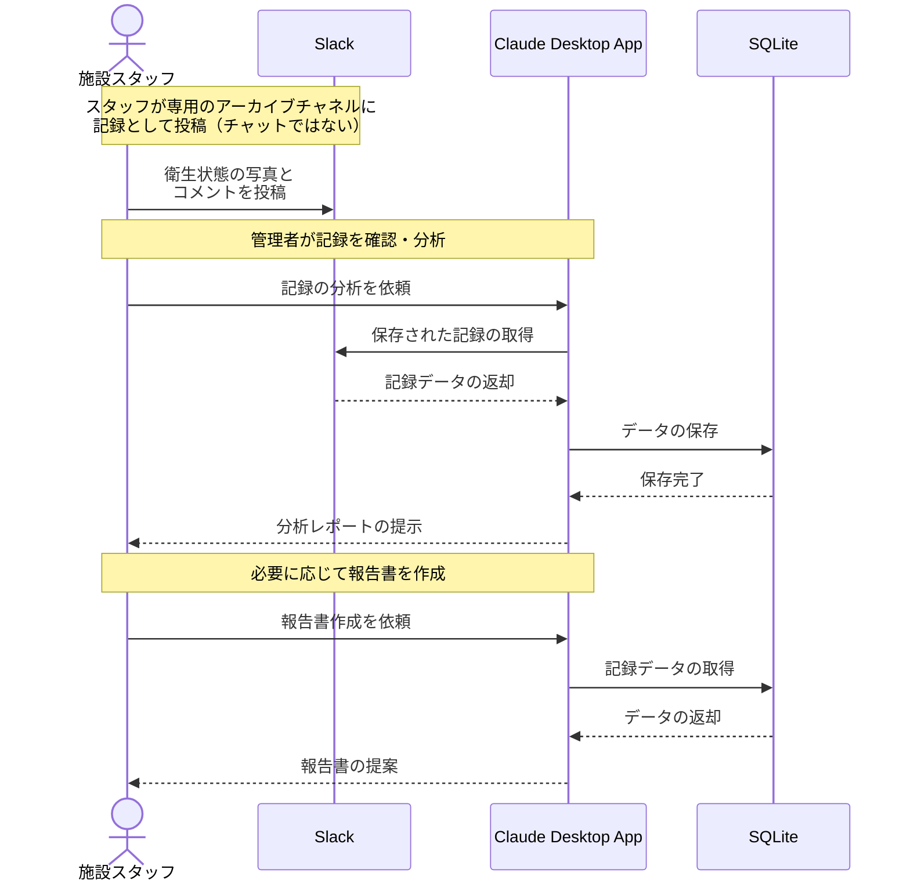

# 施設の衛生管理記録を効率化する

## アイデア
SQLiteとSlackを組み合わせることで、日々の衛生管理記録をデジタル化し、記録業務を効率化します。特にSlackは「コミュニケーションツール」としてではなく、「スマートフォンから手軽に写真付きの記録を残せる媒体」として活用します。チャットではなく、構造化された記録保存の入力インターフェースとして位置付けます。

### 具体例
介護施設や保育施設での手洗い場や調理場の衛生状態チェック時に、スタッフがスマートフォンで撮影した写真をSlackの専用チャネルに投稿。このチャネルはチャットではなく、「写真付き記録の保管庫」として機能し、投稿された情報が自動的にデータベースに記録として保管・活用されます。

## アーキテクチャ

| Type | Name | Role |
|--|--|--|
| Client | Claude Desktop App | 記録の分析と報告書作成の支援 |
| Server | SQLite | 衛生管理記録の構造化データの保存 |
| Server | Slack | 写真付き記録の入力インターフェース（※コミュニケーションツールとしては使用しない） |

## 思考プロセス

### 対象の活動の価値は何か
- 施設の衛生状態を適切に管理・記録することで、利用者の安全を確保 
- スマートフォンを使った手軽な記録による、作業効率の向上 
- 視覚的な記録の蓄積による、より正確な状態把握

### 価値を妨げる課題は何か
1. 紙ベースでの記録による非効率性 
2. 写真などの視覚的な記録の管理の難しさ 
3. 記録媒体が分散することによる管理の複雑さ

### なぜ課題が発生するのか、仮説推論
1. 紙ベースでの記録による非効率性
    - 手書きによる記入の手間と時間的コスト 
    - 記録の検索や集計が困難 
    - 保管場所の物理的制約

2. 写真などの視覚的な記録の管理の難しさ
    - 従来の記録方法では写真の添付や管理が煩雑 
    - 撮影した写真と記録の紐付けが手動作業

3. 記録媒体が分散することによる管理の複雑さ
    - 紙の記録と電子データが別々に存在 
    - 写真データの保存場所が不統一