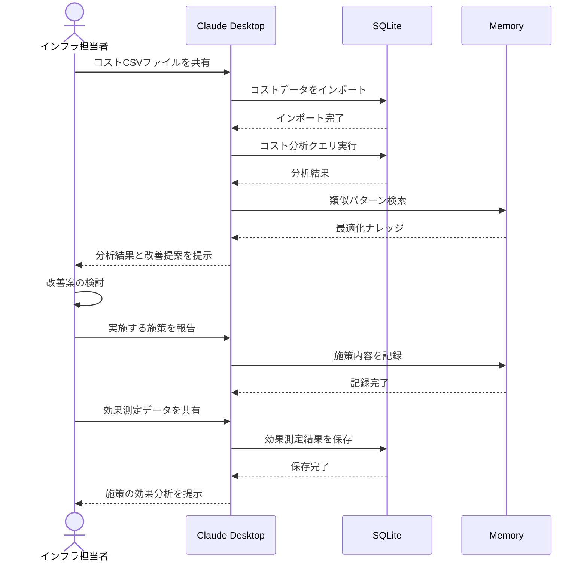

# クラウドコストの分析を自動化する

## アイデア
SQLiteとMemoryを組み合わせて、クラウドコストの分析と最適化提案を自動化。過去の最適化施策の効果や、類似企業の成功パターンを参考に、具体的な改善提案を生成する。

### 具体例
急成長中のスタートアップで、クラウドコストの急増に対応するため、利用明細データの分析から具体的な最適化案の提示、そして施策実施後の効果測定までを一気通貫で支援する。

## アーキテクチャ
| Type | Name | Role |
|--|--|--|
| Client | Claude Desktop App | コスト分析と改善提案の対話型支援 |
| Server | SQLite | コストデータの蓄積と分析基盤 |
| Server | Memory | 過去の最適化施策の知識ベース |

## 思考プロセス

### 対象の活動の価値は何か
- 無駄なコストを削減し、企業の収益性向上に貢献する
- インフラ構成の最適化により、運用効率が改善する
- 経営判断に必要なコストの透明性が確保される

### 価値を妨げる課題は何か
1. コスト分析に必要なデータ収集と整理に多大な時間がかかる 
2. サービス間の依存関係により、安易なリソース削減ができない 
3. 将来のワークロードを予測した最適化が難しい 

### なぜ課題が発生するのか、仮説推論
1. データ収集の問題
    - 複数のサービスやリージョンのデータを手動で集約する必要がある
    - リソースのタグ付けが不完全で、コストの帰属が不明確 

2. 依存関係の問題
    - マイクロサービス化により、サービス間の関係が複雑化している
    - リソースの共有により、個別のコスト配分が難しい 

3. 予測の問題
    - 急激な成長フェーズでは、過去のデータだけでは予測が困難
    - セール施策などビジネスイベントの影響を定量化できない