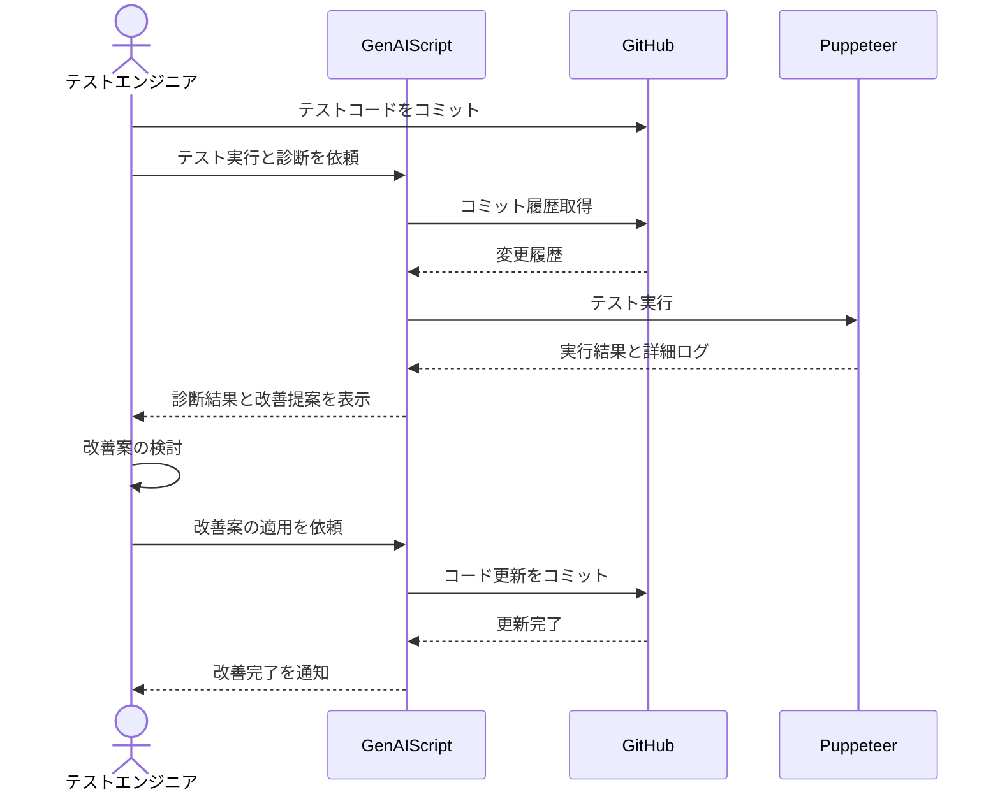

# テスト自動化の診断を効率化する

## アイデア
GitHubとPuppeteerを組み合わせて、テスト自動化スクリプトの品質診断と改善提案を行う。テスト実行の履歴やコードの変更履歴を分析し、不安定なテストの特定や改善方法の提案を自動化する。

### 具体例
決済フローのUIコンポーネントのテスト自動化において、テストの失敗履歴とコードの変更履歴を分析し、非同期処理の待機時間設定の最適化や、環境依存の問題を特定して具体的な改善案を提示する。

## アーキテクチャ
| Type | Name | Role |
|--|--|--|
| Client | GenAIScript | テスト実行とコード分析の統合環境 |
| Server | GitHub | テストコードとテスト実行履歴の管理 |
| Server | Puppeteer | テスト実行とブラウザ操作の分析 |

## 思考プロセス

### 対象の活動の価値は何か
- テスト実行の工数が大幅に削減され、開発速度が向上する
- 人的ミスが減少し、テストの信頼性が向上する
- 共通化されたテストコードにより、チーム全体の生産性が向上する

### 価値を妨げる課題は何か
1. 自動テストの保守コストが予想以上に高くなってしまう 
2. テストの失敗原因の特定が難しく、デバッグに時間がかかる 
3. 環境依存の問題で、テストの実行が不安定になる 

### なぜ課題が発生するのか、仮説推論
1. 保守コストの問題
    - 画面の仕様変更のたびにテストコードの修正が必要になる
    - 共通化を意識しすぎて複雑な実装になってしまう 

2. デバッグの問題
    - テストフレームワークのエラーメッセージが不親切で原因特定が困難
    - 非同期処理の待機時間の設定が適切でないケースが多い 

3. 安定性の問題
    - テスト実行環境ごとの差異を十分に考慮できていない
    - テストデータの状態管理が不完全である