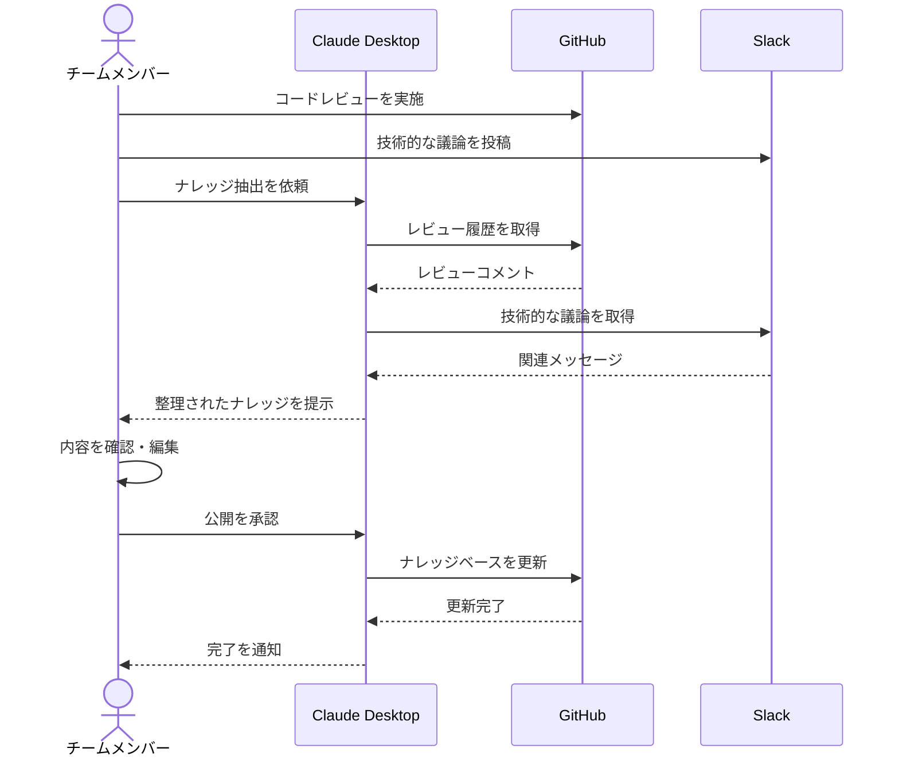

# ナレッジベースを継続的に進化させる

## アイデア
GitHubとSlackを組み合わせて、日々のコミュニケーションやコードレビューから自動的にナレッジを抽出・整理し、チームの知識ベースを継続的に進化させる仕組みを構築する。

### 具体例
マイクロサービス開発チームで、コードレビューでの指摘事項や設計に関する議論、トラブルシューティングの過程などを自動的に収集・整理し、検索可能なナレッジベースとして維持・更新する。

## アーキテクチャ
| Type | Name | Role |
|--|--|--|
| Client | Claude Desktop App | ナレッジの抽出と整理を対話的に支援 |
| Server | GitHub | コードとレビューコメントの管理 |
| Server | Slack | チーム内コミュニケーションの収集 |

## 思考プロセス

### 対象の活動の価値は何か
- チームの知識が体系化され、新メンバーの立ち上がりが迅速になる
- トラブル対応の時間が短縮され、開発効率が向上する
- チーム全体の技術力が底上げされ、品質が向上する

### 価値を妨げる課題は何か
1. ナレッジベースの更新が継続的に行われず、情報が陳腐化する 
2. 情報の粒度やフォーマットにばらつきがあり、検索性が低下する 
3. 暗黙知の文書化が不完全で、重要な知見が抜け落ちる 

### なぜ課題が発生するのか、仮説推論
1. 更新停滞の問題
    - 日々の開発業務で手一杯で、ドキュメント更新が後回しになる
    - 更新の重要性は理解しているが、優先度が低く設定されがち 

2. 品質のばらつきの問題
    - 書き手によって重視するポイントが異なる
    - テンプレートや規約が明確に定められていない 

3. 暗黙知の問題
    - 「当たり前すぎて書く必要がない」と判断してしまう
    - 経験則や直感的な判断を言語化するのが難しい