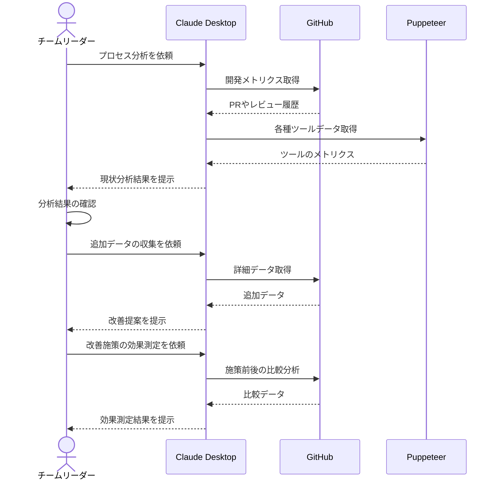

# 開発プロセスを自動で可視化する

## アイデア
GitHubとPuppeteerを組み合わせて、開発プロセスのデータを自動収集し、継続的なプロセス改善を支援する。定量・定性データの収集から分析、可視化までを自動化し、チームの改善活動をデータドリブンに推進する。

### 具体例
中規模の開発チームで、各種開発ツールからデータを自動収集し、ボトルネックの特定から改善提案、効果測定までを一気通貫で支援。チームメンバーの体感的な課題もヒアリングし、総合的な改善を推進する。

## アーキテクチャ
| Type | Name | Role |
|--|--|--|
| Client | Claude Desktop App | 分析と改善提案の対話型支援 |
| Server | GitHub | 開発活動データの収集と分析 |
| Server | Puppeteer | 各種ツールからのデータ収集 |

## 思考プロセス

### 対象の活動の価値は何か
- 開発プロセスのボトルネックが特定され、効率的な改善が可能になる
- チーム全体の生産性の定量的な評価と改善が可能になる
- データに基づく意思決定により、改善施策の効果が測定可能になる

### 価値を妨げる課題は何か
1. データ収集と集計に多大な工数がかかり、継続的な実施が困難 
2. 数値化できない質的な要素の評価が不完全になりがち 
3. メトリクスへの過度な注目により、本質的な改善が疎かになる 

### なぜ課題が発生するのか、仮説推論
1. データ収集の問題
    - 各種ツールのデータ形式が異なり、統合が手間
    - 自動化されていない集計作業が多く存在 

2. 質的評価の問題
    - チーム内のコミュニケーションの質など、数値化が難しい要素が存在
    - コンテキストの違いにより、単純な数値比較が意味を持たない 

3. 本質からの乖離の問題
    - 測定可能な指標に注目が集中し、重要だが測定困難な要素が軽視される
    - 数値改善が目的化し、実質的な価値創出が二の次になる