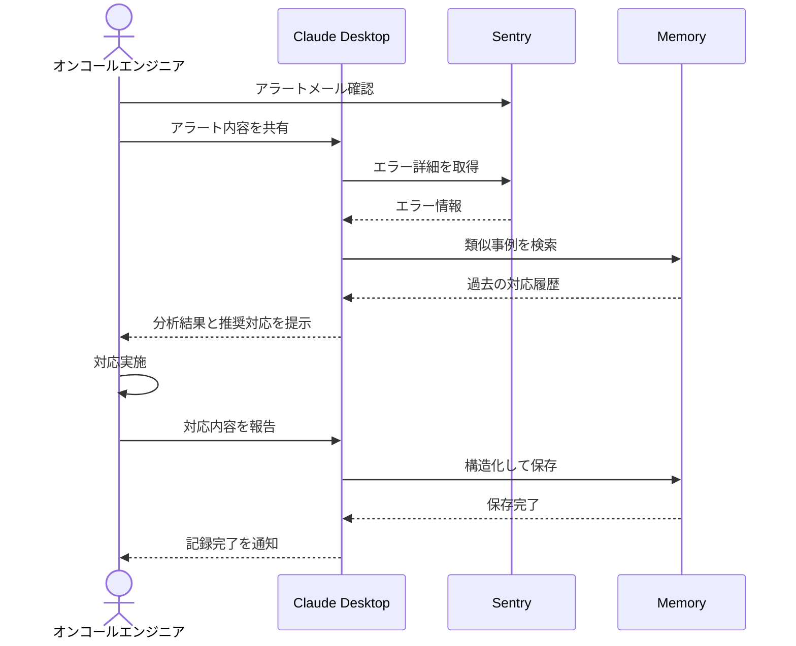

# 障害対応履歴の活用を最適化する

## アイデア
Sentryとmemoryを組み合わせて、アラート発生時に過去の類似事例を自動的に分析・提示し、さらに対応結果を構造化して蓄積することで、障害対応の質を向上させる

### 具体例
深夜帯のオンコール時に決済システムで異常が検知された際、新人エンジニアが過去の類似事例と解決策を即座に参照でき、さらに自身の対応内容も適切に記録できる

## アーキテクチャ
| Type | Name | Role |
|--|--|--|
| Client | Claude Desktop App | 過去事例の分析と対応方針の提示 |
| Server | Sentry | エラー情報の取得と新規イベントの検知 |
| Server | Memory | 過去の対応履歴の構造化保存と検索 |

## 思考プロセス

### 対象の活動の価値は何か
- 経験の少ないエンジニアでも過去の知見を活用した適切な判断が可能になる
- 類似事例の参照により、対応時間を大幅に短縮できる
- 過去の成功パターンを再利用することで、確実な問題解決につながる

### 価値を妨げる課題は何か
1. 過去事例の記録品質にばらつきがあり、有用な情報を見つけられない 
2. 似て非なる事例を誤って参照し、的外れな対応をしてしまう 
3. 過去事例への依存が強すぎて、新しい種類の問題に対する思考が硬直化する 

### なぜ課題が発生するのか、仮説推論
1. 記録品質の問題
    - 緊急対応後の疲労で詳細な記録を後回しにしてしまう
    - 「自分には分かる」程度の簡易な記録で済ませてしまう 

2. 誤った参照の問題
    - アラートの表面的な類似性で判断し、根本原因の違いを見落とす
    - 時間的なプレッシャーで十分な検証をせずに対応を進めてしまう 

3. 思考硬直化の問題
    - 「前回こうしたから今回も」という安易な判断に流れやすい
    - 新しい問題に直面した際の創造的な思考力が育たない